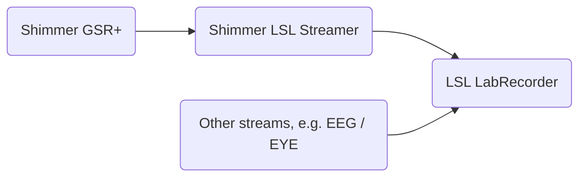

# Shimmer LSL streamer

As the name says, this is a script that allows you to send data from a shimmer device to LSL Lab Recorder, using the LabStreamingLayer.

This works with Shimmer GSR+ is a (typically) wristwarn sensor to record skin conductance (also known as EDA or GSR), heart rate (using a photoplythesmographer, PPG), electrocardiography (ECG) as well as kinematics (using 3-axis accelerometer, gyroscope and magnetometer). 

In our research we mainly use the GSR (skin conductance) and heart-rate module, to undertand emotional reactions to different environments. We often collect multiple datastreams from stimuli, behaviour (e.g. reaction times), EEG, and eye-tracking. 

One open-source solution to integrate all these datastreams in a single file *during* data collection (which save post-processing time and effort) is the [LabStreamingLayer, or LSL](https://github.com/sccn/labstreaminglayer/), which allows the synchronisation across multiple devices, datastreams and even computers (as long as they are on the same network. 

The script is put together using example files from shimmer and lsl. A GUI was added to make experimental sessions a littel easier to run.

# Data
While in use, the script receives data from the shimmer, and trasmits three variables: _timestamp, skin conductance, and heart-rate._

# Instructions for use
To use/run the script, you will need:
1. A Shimmer GSR+ device (concected to your computer over bluetooth.;-))
2. A working version of Matlab. 
3. Download [LSL for matlab](https://github.com/labstreaminglayer/liblsl-Matlab/), and follow the installation instructions.
4. Download [shimmer for Matlab](https://github.com/ShimmerEngineering/Shimmer-MATLAB-ID) and follow the installation instructions.
5. Opent he shimmer_lsl_streamer.m file
6. Check which comport is connecting to the Shimmer.
7. initialise the streamer by typing shimmer_lsl_streamer('<comport>') make sure to replace <comport> with the ID of the port the shimmer is connected (e.g. '12')
8. select the montage you are using (i.e. where have you placed the EDA electrodes?)
9. press 'connect' to connect with the shimmer AND start an LSL stream
10. press 'start' to start streaming data to LSL
11. press 'stop' to stop streaming data LSL (for now this does not close the LSL stream, just stops sending data over).
12. Collect and record your data in [LabRecorder](https://github.com/labstreaminglayer/App-LabRecorder).

# A note on timestamp accuracy (#synchronisation)
The LSL framework handles the synchronisation (and potential delays) between matlab and LabRecorder / other data streams.
At present the timestamp of each sample is taken from the clock of the computer, _not_ the clock of the sensor. Therefore, there might be an offset of a few milliseconds between the time a sample is measured and the timestamp associated with it (the time it takes to reach the computer over bluetooth). According to Shimmer this is around 25 milliseconds (max 100ms), which should be sufficient for the measurement of 'slow response signals' such as skin conductance (reaction to stimuli is on the range of a several seconds). Better solutions for more precise timing are welcome!

# Future work / To do
- select COMPORT from the GUI
- change sampling rate from the GUI
- stream other data (gyro, accel, etc)
- improve timestamp, using the shimmer timestamp (see above time-syncrhonisation)
- close LSL stream when the user presses stop, or when then GUI is closed

# Alternatives
_I don't like/have Matlab, are there any other options I can use for my experiment?_

Yes! 
[@ryohajika](https://github.com/ryohajika) has written a similar application called [ShimmerProjectECL](https://github.com/ryohajika/ShimmerProjectECL) which requires Java + Eclipse; I have not tested it.

# Disclaimer
Not related with the company that makes Shimmer devices. 
