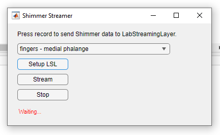

# shimmer_lsl_streamer

As the name says, this is a script that allows you to send data from a shimmer device to LSL Lab Recorder, using the LabStreamingLayer.

The script is put together using example files from shimmer and lsl. A GUI was added to make experimental sessions a littel easier to run.

# Disclaimer
Not related with the companry the makes Shimmer devices, simply 

# Instructions for use
To use/run the script, you will need:
1. A Shimmer device, concected to your computer over bluetooth.;-) 
2. A working version of Matlab. 
3. Download LSL for matlab, and follow the installation instructions.
4. Download Shimmer for Matlab and follow the installation instructions.
